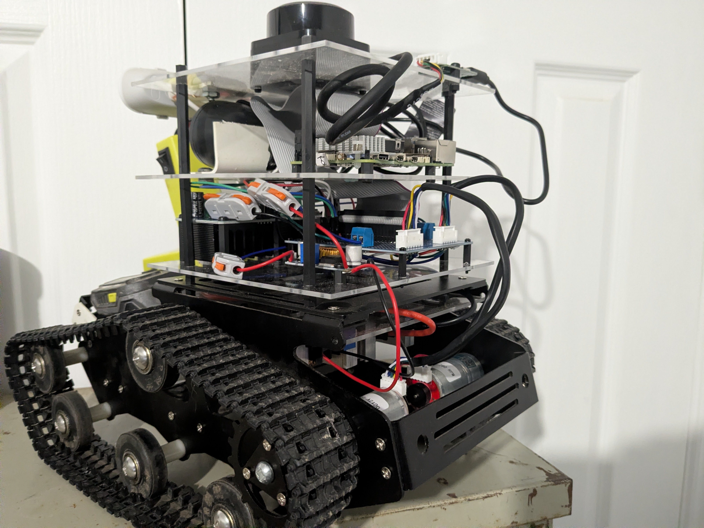
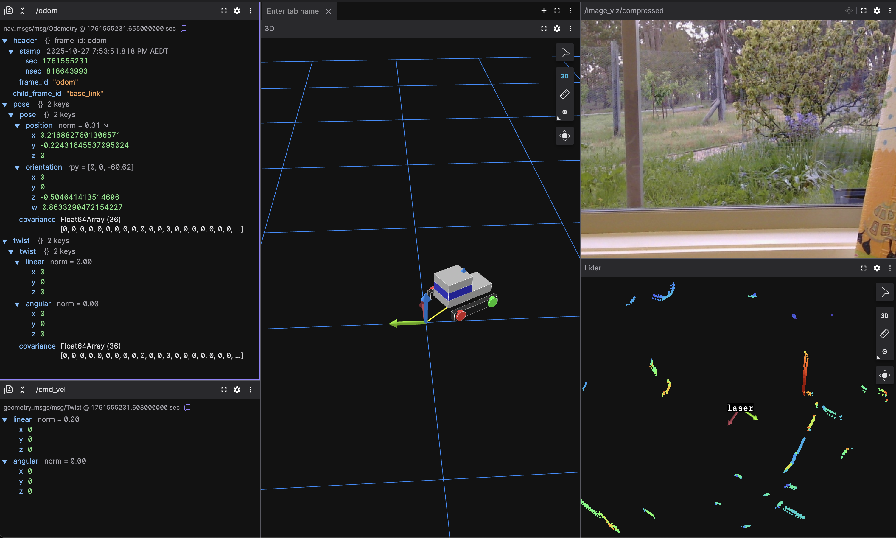

# robotics
A collection of robotics projects that I have been tinkering with to learn more.




# Features

* Drive it around manually using an Xbox controller
* Visualise data, lidar, camera views in Foxglove
* Speech to Text (STT) and wake word detection using OpenAI Whisper and Porcupine
* Onboard LLM! It has Ollama running inside docker, using the TinyLlama model. Any voice commands will be sent into the LLM
* Text to speech (TTS), any responses from the LLM will be voiced back to you, so you can have conversations!
* Lidar, it'll map the surrounds
* More features coming!

# How to install
(this will become much easier when I find the time to Docker-ise it, but for now, we'll just install directly onto the host system)

The instructions are quite long, see the [INSTALL](docs/INSTALL.md) for the full instructions.


# How to run
I've made it very easy to run the robot:
```bash
make build
make launch
```

You can also run individual packages such as `make launch-senses` if you wanted to run a single subsystem.

It'll run the foxglove bridge too, so point that at `ws://pi5:8765` and you'll see this



It isn't particularly useful on it's own, so run the "bringup" which will launch all components, so you can control it and see sensor data etc

# Parts List
Here is a list of the parts I used. Aside from the Pi and the Logitech webcam, everything else I got from AliExpress.
See the [HARDWARE](docs/HARDWARE.md) page for more info about the build.

- Xiaor geek tank chassis
- 2 x JGA25-371 12V DC Gear Motor Encoder, 280rpm
- Raspberry Pi 5
- Logitech Brio100 webcam
- Cheap USB speakers from AliExpress
- Xbox controller (this must be one of the newer, bluetooth / USB-C models. The OG xbox one controllers had a proprietary wireless protocol)
- Cheap Buck converters from AliExpress to step down the 18v to 12v for the motors and 5v for the pi, and 3.3v for LEDs / motor encoders
- 2 x BTS7960 H bridge motor drivers
- 150mm x 150mm acrylic sheets to make the layers of the robot stack
- Various m3 spacers, smaller 10mm for holding PCBs, then 50-75mm to space the layers depending on whats in them
- Dupont cables, box of JST-XH connectors, 14awg for the batteries/motors, 22awg elsewhere
- Googly eyes


# Why am I building this?
Mostly curiosity, and I enjoy tinkering with things and solving hard problems. Robotics gives me a fantastic platform to explore and learn:
* Electronics, hardware design, and soldering
* Software, ros2, python, c++
* Computer vision, machine learning, and AI
* SLAM, navigation, and autonomy
* Visualisation and simulators
* CAD and 3d printing (for when R2 eventually gets a new body)
