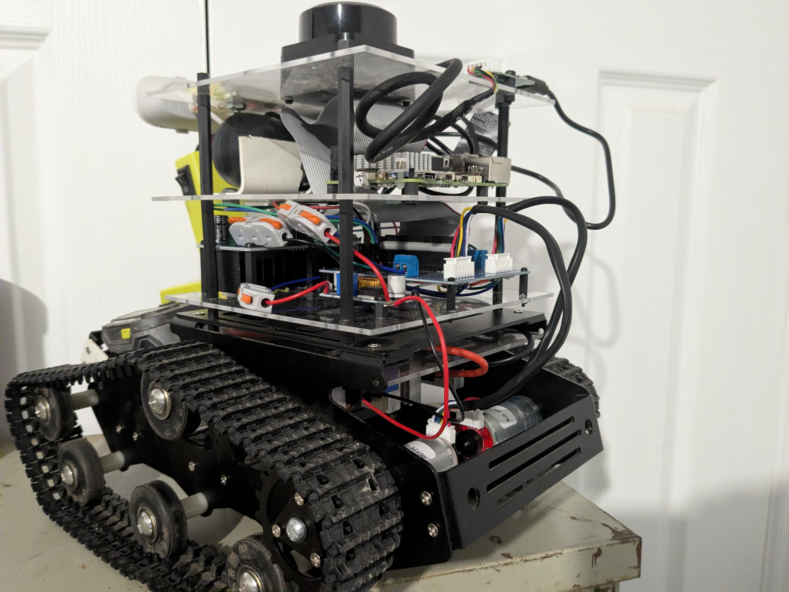
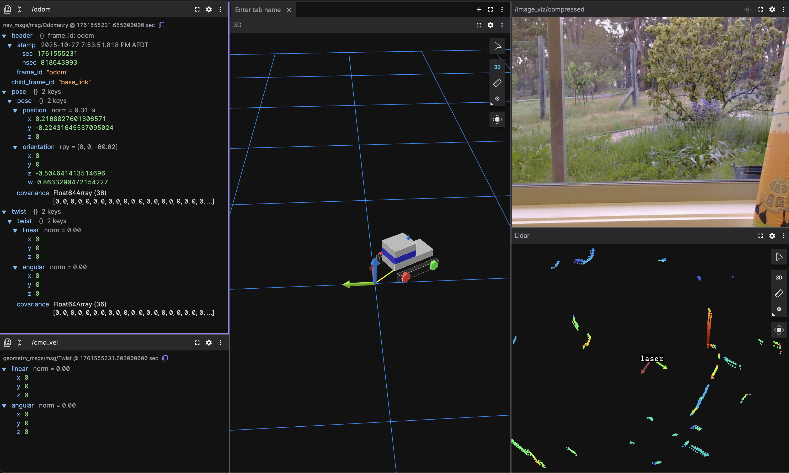

# robotics

R2 is a ROS 2 tank robot built to explore electronics, perception, voice agents,
mapping, and navigation.

> **VENTUNO Q migration in progress.** Development continues on `main`, one
> reviewable phase at a time. See the [migration plan and progress](docs/VENTUNO_MIGRATION.md).
> The board is not yet connected to the robot; the current checkout is not a
> working VENTUNO deployment.
>
> **Looking for the Raspberry Pi 5 version?** The original code and instructions
> are preserved at [the Pi baseline commit](https://github.com/jameselsey/robotics/tree/8100627c087d5cc25e0c40bdf27b5d8a42e131bf).
> The planned archive tag is `pi5-final`; its creation and push are a user-owned
> step documented in the migration guide.




## Existing robot capabilities

The Pi implementation provides:

- Manual driving with an Xbox controller and quadrature encoder odometry.
- Foxglove visualization of the robot, camera, LiDAR, maps, transforms, and diagnostics.
- Wake-word and controller-triggered conversations through a Strands/Nova Sonic voice agent.
- Spoken responses and LED feedback, camera questions through Nova Lite, and robot tools.
- SLAM mapping, saved-map localization, semantic room annotations, and Nav2 navigation.

The VENTUNO migration will retain these capabilities while moving Linux
application dependencies into Docker Compose and GPIO duties to the STM32.
Local Whisper, GenieX, and Piper services will become the default voice backend;
Nova will remain selectable. Compose infrastructure is implemented; local voice
and STM32 integration remain pending.

## Installation and operation

Read [installation status](docs/INSTALL.md) before installing dependencies.
For the complete original Pi setup, use the baseline link above.

The container build and hardware-independent checks are now available:

```bash
make config
make build
make test
```

See [container operation](docs/CONTAINERS.md) for persistent data, model setup,
service profiles, device configuration, and operator commands. The robot remains
gated until phase 4 implements the STM32 and local voice adapters. Do not run the
old Pi GPIO code on VENTUNO. Robot launch/stop remains under your terminal control.

Once the robot is running, connect Foxglove from a Mac on the same network to
`ws://<robot-hostname-or-IP>:8765`. The final VENTUNO connection and acceptance
checks will be documented during the migration.



## Project documentation

- [ROS packages](src/README.md)
- [Container build and operation](docs/CONTAINERS.md)
- [Hardware build photographs and Pi chassis notes](docs/HARDWARE.md)
- [Camera and voice vision](docs/CAMERA.md)
- [Mapping and room annotation](docs/MAPPING.md)
- [Encoder calibration and SLAM diagnostics](docs/slam-mapping-guide.md)
- [Localization and navigation](docs/NAVIGATION.md)
- [Historical ROS maintenance audit](docs/ros2-maintenance-audit.md)

## Hardware

The existing chassis uses:

- Xiaor Geek tank chassis with two JGA25-371 12 V encoder gear motors, 280 rpm.
- Two BTS7960 H-bridge motor drivers.
- Raspberry Pi 5, being replaced by Arduino VENTUNO Q.
- USB LiDAR, Logitech Brio 100 webcam/microphone, and USB speakers.
- Xbox controller with Bluetooth/USB support.
- Ryobi 18 V battery and buck converters for the original Pi installation.
- Acrylic layers, M3 spacers, JST-XH connectors, wiring, and googly eyes.

The photographs and existing power arrangements describe the Pi build. VENTUNO
power requirements and verified motor/encoder/LED pin assignments will be
provided in phase 4 before rewiring.

## Why build this?

Mostly curiosity, and the opportunity to learn electronics, hardware design,
soldering, Python, ROS 2, computer vision, AI, SLAM, navigation, CAD, and 3D printing.
